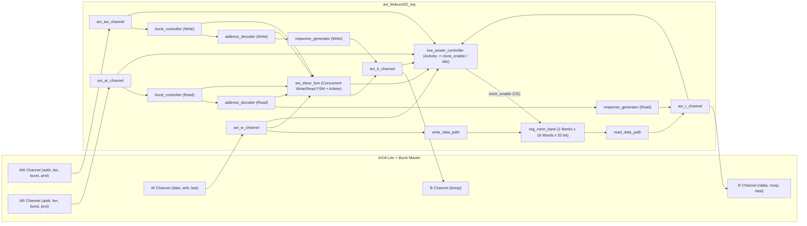

# Block Diagram — AXI-LiteBurst-32

## System-Level Concurrent Architecture

```mermaid
flowchart LR
    subgraph Master["AXI4-Lite + Burst Master"]
        M_AW["AW Channel (addr, len, burst, prot)"]
        M_W["W Channel (data, strb, last)"]
        M_B["B Channel (bresp)"]
        M_AR["AR Channel (addr, len, burst, prot)"]
        M_R["R Channel (rdata, rresp, rlast)"]
    end

    subgraph Slave["axi_liteburst32_top"]
        AW["axi_aw_channel"]
        W["axi_w_channel"]
        B["axi_b_channel"]
        AR["axi_ar_channel"]
        R["axi_r_channel"]

        WR_BC["burst_controller (Write)"]
        RD_BC["burst_controller (Read)"]

        WR_DEC["address_decoder (Write)"]
        RD_DEC["address_decoder (Read)"]

        WR_RSP["response_generator (Write)"]
        RD_RSP["response_generator (Read)"]

        WDP["write_data_path"]
        RDP["read_data_path"]

        FSM["axi_slave_fsm (Concurrent Write/Read FSM + Arbiter)"]
        MEM["reg_mem_bank (2 Banks x 16 Words x 32-bit)"]
        LP["low_power_controller (Activity -> clock_enable / idle)"]
    end

    M_AW --> AW --> WR_BC --> WR_DEC --> WR_RSP
    M_W --> W --> WDP --> MEM
    WR_DEC --> FSM
    WR_BC --> FSM
    W --> FSM
    FSM --> B --> M_B
    WR_RSP --> B

    M_AR --> AR --> RD_BC --> RD_DEC --> RD_RSP
    RD_DEC --> FSM
    RD_BC --> FSM
    MEM --> RDP --> R --> M_R
    RD_RSP --> R

    AW & W & B & AR & R & FSM --> LP
    LP -- "clock_enable (CE)" --> MEM
```
